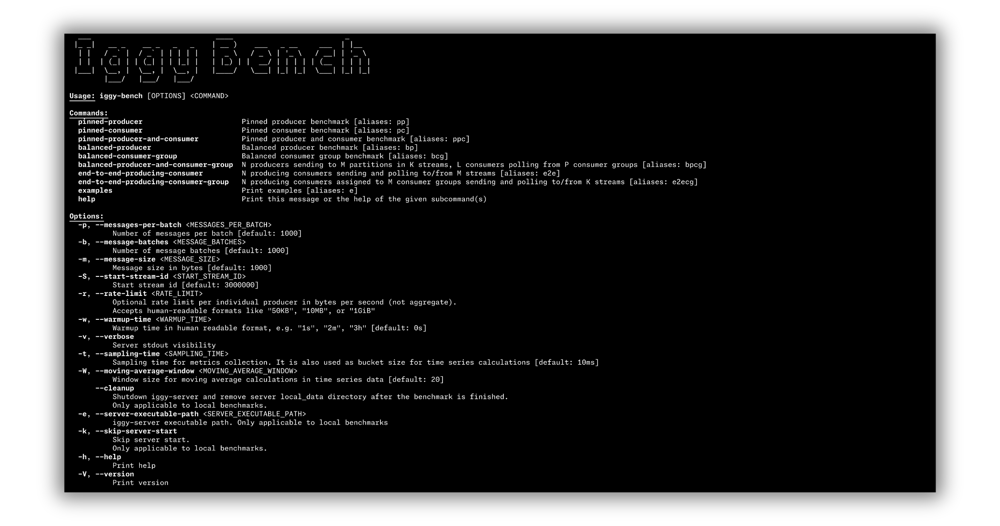

# Apache Iggy Bench CLI

The interactive Bench CLI allows you to perform various benchmarking on the Apache Iggy server.

Iggy Bench CLI can be installed with `cargo install iggy-bench` and then simply accessed by typing `iggy-bench` in your terminal.



The WebSocket transport command is `websocket`, with `ws` as a shorthand.

## Examples and topic options

Start Iggy before running benchmarks. The tool connects to an existing server. Run `iggy-bench examples` for all eight benchmark kinds, their aliases, all four transports, and topic-option combinations. Global options precede the benchmark kind, kind-specific options follow it, and the server address follows the transport.

Both `--durability` and `--consumer-offset-durability` independently default to `replicated`. The following runs use the same workload with different topic policies:

```bash
# Both policies replicated, the default.
iggy-bench balanced-producer-and-consumer-group tcp

# Persisted message acknowledgments with replicated offsets.
iggy-bench --durability persisted balanced-producer-and-consumer-group tcp

# Replicated message acknowledgments with persisted offsets.
iggy-bench --consumer-offset-durability persisted balanced-producer-and-consumer-group tcp

# Both policies persisted.
iggy-bench --durability persisted --consumer-offset-durability persisted balanced-producer-and-consumer-group tcp
```

These options apply when the benchmark creates topics. They do not change existing topics with `--reuse-streams`. Both policies normally write data to disk. `persisted` adds a stable-storage completion requirement. Consumer workloads using poll auto-commit still receive asynchronous poll responses, so this flag does not turn their poll latency into a measurement of acknowledged offset-store latency.

`--messages-required-to-save` controls a topic's segment-flush cadence independently of durability. `--max-topic-size` and `--message-expiry` are kind-specific topic options. Use the selected kind's `--help` to inspect supported flags. OS writeback settings do not replace these policies.

## Host preparation

Use a dedicated server and a separate load generator where possible. If they share a host, assign disjoint CPU sets and leave CPU capacity for kernel and network work. Match the deployment's CPU topology, storage, replication-group size, and durability policies.

| Area | Starting point | What to check |
| --- | --- | --- |
| Runtime access | Permit the service to create `io_uring` instances. | Startup diagnostics, container syscall policy, and effective process limits. |
| File descriptors and locked memory | Size limits for connections, partitions, and runtime allocations. | `/proc/PID/limits`, not just the shell's `ulimit`. Set systemd service limits explicitly. |
| Swap | With enough RAM and disk-backed swap, compare `vm.swappiness=10` against the existing value. | Swap activity, memory pressure, and p99 latency. This does not disable swap. |
| Huge pages | Start without an explicit reservation, then test a budgeted pool with a compatible allocator. | Actual page size, usage, NUMA placement, and memory left for page cache. |
| CPU placement | Use the server's `[sharding]` options within its allowed CPU set. | Per-core load, CPU steal time, cgroup throttling, and IRQ distribution. |
| Writeback | Start with the OS defaults. | Sustained disk latency and dirty-page buildup. Large percentage limits can mask short-run bottlenecks. |
| Networking | Start with the OS defaults. | Receive drops, retransmissions, connection backlogs, and bandwidth-delay requirements before increasing limits. |

Read the [Linux tuning guide](https://iggy.apache.org/docs/server/linux-tuning) before reserving huge pages. `vm.nr_hugepages=2048` reserves 4 GiB only with 2 MiB pages. **`MIMALLOC_RESERVE_HUGE_OS_PAGES=2048` requests 2048 one-GiB pages, or 2 TiB.** They are different controls. The guide explains allocator configuration, THP, service limits, permissions, and reboot persistence.

### Repeatable measurements

1. Record the server and benchmark revisions, build profile, kernel, VM type, CPU allocation, allocator, memory limits, filesystem, and provisioned disk/network capacity.
2. Keep workload shape, both durability policies, replication-group size, and topic options identical between compared runs. Use an explicit warmup and repeat runs.
3. Observe `vmstat 1`, `iostat -xz 1`, `mpstat -P ALL 1`, memory/I/O pressure, and network errors. Confirm the client has spare CPU and network capacity.
4. Run long enough to include segment flushes, checkpoints, and sustained device limits. Distinguish warm-cache tests, cold-cache tests, and storage throughput. Do not drop caches during a production workload.
5. Change one host setting at a time, retain its previous value, and compare throughput, p50/p99/p99.9 latency, memory, and errors. Record successful changes in provisioning and recheck after reboot.

The `output` subcommand records results and accepts context for the run:

```bash
iggy-bench --warmup-time 10s --total-data 10GiB balanced-producer tcp output --identifier baseline --remark replicated-defaults
```

Choose `--total-data` for the duration and storage behavior being tested. This example is not a universal sufficient data volume.
