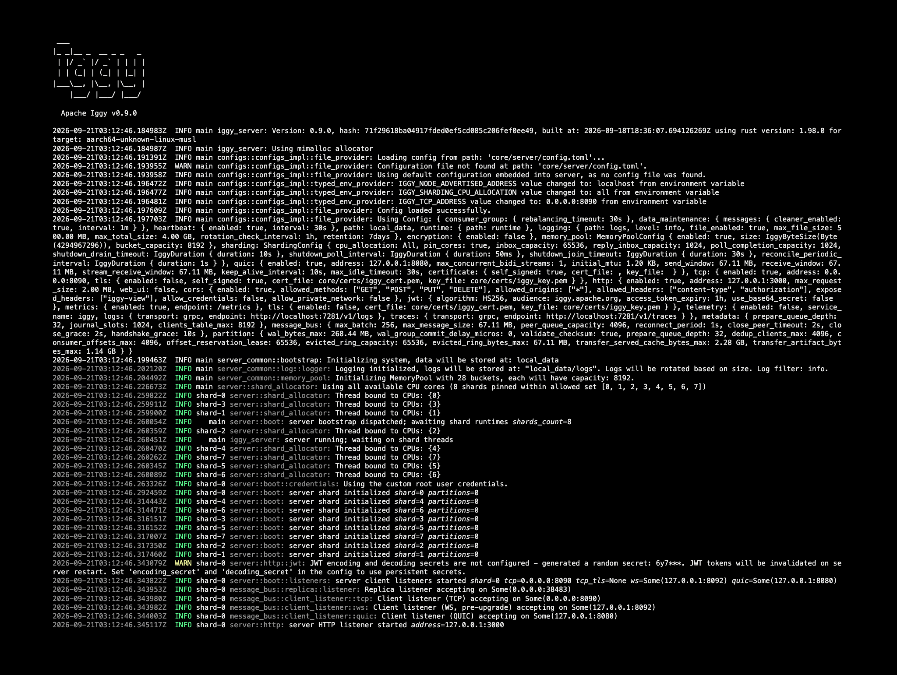
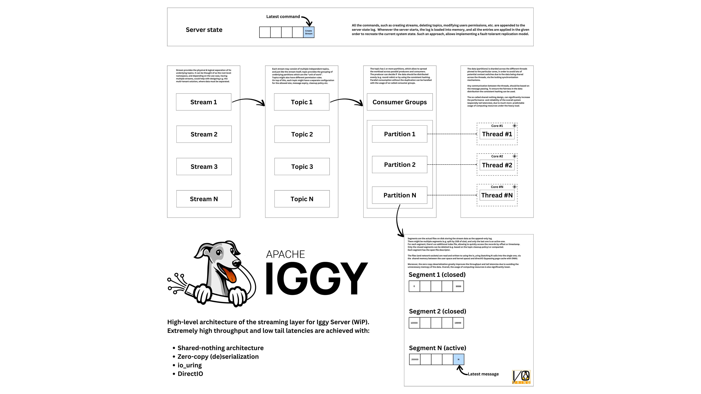

# Apache Iggy Server

The core server component of Apache Iggy: a persistent, append-only log for message streaming. It runs thread-per-core and shared-nothing on `io_uring` (through `compio`), and commits every write through Viewstamped Replication (VSR), so the same binary serves a standalone node and a multi-node cluster.

Clients connect over TCP (custom binary protocol), QUIC, WebSocket, or the HTTP REST API.

## Running

```sh
cargo run --bin iggy-server --release
```

Missing or empty storage is initialized automatically. Existing incompatible
storage is refused without modification. `--fresh` deletes existing data in
the configured system path and must be an explicit reset, never a restart
default. A new cluster starts automatically when its metadata WAL and
superblock are absent. A node with retained metadata rejoins through recovery.
Loss of a replica's entire metadata directory is outside the automatic recovery
guarantee, including loss on every replica. Empty metadata cannot distinguish a
new cluster from a previously used one. Restore a verified consistent backup
through a validated recovery procedure before restarting erased metadata disks.

The Docker image `apache/iggy:latest` ships the server together with the CLI; the `edge` tag tracks the latest development build.

The image binds every listener to `0.0.0.0` so the container is reachable from outside it. A wildcard bind says which interfaces accept connections, not where a client reaches the server, so the address to publish in cluster metadata has to be supplied and the server refuses to start without it. On a single host with published ports that address is `localhost`:

```sh
docker run -p 3000:3000 -p 8090:8090 \
  -e IGGY_NODE_ADVERTISED_ADDRESS=localhost apache/iggy:latest
```

Use the hostname or load balancer address clients actually dial when they are not on the same host. The Helm chart derives it from the Service DNS name.

To run one node of a cluster, pass its replica ID from the `cluster.nodes` roster:

```sh
cargo run --bin iggy-server --release -- --replica-id 0
```

`--replica-id` selects the configured replica. Other settings come from configuration.

## Configuration

Settings are read from [config.toml](config.toml), resolved relative to the working directory. Set `IGGY_CONFIG_PATH` to load a different file.

Any single value can be overridden with an `IGGY_`-prefixed environment variable that mirrors the TOML path:

```sh
IGGY_TCP_ADDRESS=127.0.0.1:8090 IGGY_HTTP_ENABLED=false cargo run --bin iggy-server
```

Cluster membership, quorum and replica addressing live under `[cluster]`.

Protocol 0.11.1 uses client-owned registration proofs and `BindSession` (15) to
share a logical session across connections. Command 14 is retired. Primary
polling uses commands 103 and 104; offset routing uses 123. Disconnecting a
connection does not log out its logical session. Server-observed activity renews
the session lease, and expiry or explicit logout retires it before capacity is
reused.

External group offsets belong to groups managed outside Iggy, such as a Kafka
gateway. They require no Iggy group membership and can exceed the partition's
message-offset range.

The bind proof is an independent session credential. Password changes and PAT
revocation or expiry do not end an established session. Binding checks that the
owner still exists and is active; current permissions still govern each request.
Explicit logout, lease expiry and user deactivation end session access.

`clients_table_max` and `dedup_clients_max` nominate immutable limits when the
first operation commits in each metadata or partition group. Recovery and state
transfer preserve those committed limits. Configuration changes affect groups
that have not committed a limit yet; existing groups log a mismatch and retain
their committed capacity. At capacity, new sessions or writers are refused until
ordered retirement releases slots. Live retry protection is never evicted.

HTTP writes using one session and partition serialize through the previous
write's reply or bounded deadline. With `ack=none`, a request returns 202 after
its dispatch, while the next request to that partition waits for the previous
write to settle. Waiters acquire the in-flight permit after the partition gate,
so they do not consume the session's budget for other partitions.

Durability defaults remain `Replicated`, and ordinary SDK sends and explicit
offset writes support the configured policy. Crash-safe send retries require
`Persisted`; crash-safe explicit offset retries require `Persisted` and
`Quorum`. Weaker policies can lose data and receipts on a crash. A retained
receipt still replays its original result, but a lost receipt cannot prevent
another execution. NoAck and internal auto-commit polls retain their weaker
completion contracts.

## Upgrade recovery

This release changes protocol and storage formats. Servers and compatible
clients deploy together; mixed versions and rolling upgrades are unsupported.
Peers verify protocol, release and storage-format identity before admission.
Executable packaging does not affect that identity, so stripping or rebuilding
the same compatible release does not by itself prevent a replica from joining.
Protocol 0.11.1 is the coordinated release boundary. Intermediate development
builds advertising that version are not a compatibility guarantee.
An unsupported data directory is refused before WAL scanning or file changes.
Replacing the binary does not migrate old data. Restore or migrate retained data
only through a separately verified procedure; copying a format marker is not
a migration.

Partition recovery refuses a superblock whose nonzero `log_view`
is below the partition's committed `created_view`. It also refuses a WAL
certificate with a nonzero `log_view` below that floor. The log names the
superblock directory or the `prepares-{revision}` WAL directory and the
recorded views. The affected partition is tombstoned locally and is not served;
its durable files are preserved.

For a superblock with `log_view` zero, recovery raises `view` to at least
`created_view` without changing `log_view`. The raised view must be persisted
before any view-scoped send, just as when no superblock record exists.

Such state can have been written by older servers, including `server-0.9.0`,
after restarting before the partition's first superblock write. The creation
view was not restored on that path. Raising a nonzero `log_view` during an
upgrade would certify history that the replica may not hold, so the server
does not repair those records automatically.

Partition directories hold a `created.revision` file with the revision that
created the partition. Recovery deletes a directory whose file names an older
revision. The partition then starts empty, as if it had no directory, and in a
cluster the replica copies its data from the other replicas.

A directory that an older server made has no such file. A delete that did not
finish before a restart leaves such a directory on disk, and a later create
with the same stream, topic and partition ids finds it. Recovery then loads the
leftover directory as the new partition. Only a leftover superblock with a
nonzero `log_view` below `created_view` trips the superblock refusal. The WAL
refusal does not apply, because each partition has its own `prepares-{revision}`
WAL directory. Recovery logs `adopting a nonempty partition directory without
created.revision` before adopting such a directory, since it cannot distinguish
a live legacy incarnation from a deleted one.

If recovery logs `falls below committed creation view` or the adoption warning
above, look at the history of the affected topic or partition first. If it was
deleted and created again with the same ids, delete it again, and then create
it again. The delete removes the leftover directory on every replica. It also
removes every message in that topic or partition, so do this only if you can
lose them.

In every other case:

1. Pause writes to the affected partition and stop the affected cluster before
   changing any recovery files. Keep the refusal logs.
2. Preserve a consistent copy of every replica's metadata, partition
   superblocks, WAL directories and segment files together with its configuration.
3. Restore only from a verified consistent backup, or use a separately validated
   recovery procedure based on retained replica history. Confirm that it preserves
   acknowledged writes and agrees with the committed partition creation metadata.

There is no automatic in-place migration for below-floor log certificates. Do not edit
view numbers or delete superblocks or WAL directories to bypass the refusal:
an empty history could then replace committed data during a view change.

Before a partition can serve, initialization publishes its incarnation in
`partition-initialization/<namespace>/created.revision` under the system data
directory. This atomic record remains outside the partition directory, including
after that directory is lost. Preserve it with metadata and partition backups.
Storage format `IGGY-DURABLE-SESSIONS-3` requires this initialization contract;
older data directories are refused before mutation.

Retirement also writes `retirement.fence` in that external namespace directory
before counting a permanently failed partition as retired. The fence names the
failed incarnation and keeps it offline on subsequent boots, even if its
partition directory is replaced. Healthy partitions and new logins can continue.
If the fence cannot be persisted, the session remains retained and retirement
retries. Temporary teardown tombstones and state transfer do not qualify as
permanent failures.

Partition retirement barriers batch up to 128 ended sessions per commit. Each
session still requires retirement reports covering every allocated partition
from a common replica quorum before metadata releases its registry slot. Segment
deletion and purge do not invalidate those reports; changes to partition
incarnations do. Metadata snapshot format 8 persists that separate revision.

A committed partition that has never initialized on this replica can finish
initialization after a crash, including when all replicas stopped before their
first WAL frontiers were published. An initialized partition with no durable
prepare-WAL frontier remains fenced as missing history. A singleton refuses to
serve it; a replicated partition requires history from a healthy peer. If every
replica lost initialized history, restarting does not clear the fence.

Preserve the files and restore a verified consistent backup or use a validated
recovery procedure. If the partition is independently known to be empty, or its
data may be discarded, delete and recreate it through the metadata API. This
creates a new partition incarnation and removes the old data. Missing files
alone are not evidence that discarding that data is safe. Do not create a WAL
frontier or remove initialization records or recovery fences manually.

## Systemd integration

Build with the `systemd` feature to enable readiness and watchdog notifications:

```sh
cargo build --bin iggy-server --release --features systemd
```

The server sends `READY=1` only after every enabled transport is bound and accepting, so a unit ordered after it can dial as soon as it is notified. When the unit sets `WatchdogSec=`, the server pings `WATCHDOG=1` at half that interval. On shutdown it sends `STOPPING=1`, which stops a long drain from counting against the watchdog.




